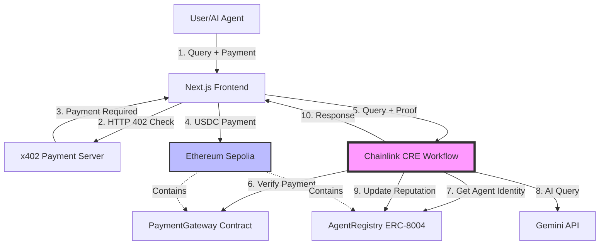

# MindChain CRE �⚡

**Decentralized AI Knowledge Platform powered by Chainlink Runtime Environment**

[](https://chain.link)
[](https://x402.org)
[](https://eips.ethereum.org/EIPS/eip-8004)
[](https://sepolia.etherscan.io)

> Built for the [Chainlink Convergence Hackathon 2026](https://chain.link/hackathon) - CRE & AI Track

---

## 🎯 Overview

**MindChain CRE** is a decentralized AI knowledge platform that demonstrates how **Chainlink Runtime Environment (CRE)** can orchestrate complex AI workflows combining:
- � **MNIST Digit Recognition** - Draw digits and get AI predictions
- 📚 **Community Knowledge Sharing** - Submit and vote on knowledge
- 💬 **AI Chat Assistant** - Powered by Gemini API
- 🆔 **Agent Identity System** - ERC-8004 on-chain reputation
- 💰 **x402 Micropayments** - Pay-per-use with USDC

### The Problem
- AI agents lack verifiable identities and reputation systems
- AI service consumption requires micropayment infrastructure
- Complex AI workflows need reliable orchestration across chains and APIs
- Current AI systems lack transparency and auditability

### The Solution
Use **Chainlink CRE** as the orchestration layer to coordinate:
1. 🧠 **AI Knowledge Operations** - Query processing, knowledge retrieval, response generation
2. 💰 **x402 Micropayments** - Pay-per-use AI services with USDC on Ethereum Sepolia
3. 🆔 **Agent Identity Management** - ERC-8004 registry for agent reputation
4. 🔗 **Cross-chain Coordination** - Seamless interaction between Ethereum and external APIs

---

## 🏗️ Architecture



---

## ✨ Key Features

- ✅ **Chainlink CRE Orchestration** - TypeScript workflows with HTTP triggers and AI integration
- ✅ **x402 Payment Protocol** - Micropayments for AI services using USDC
- ✅ **ERC-8004 Agent Registry** - On-chain agent identities and reputation
- ✅ **AI Integration** - Gemini/OpenAI for knowledge responses
- ✅ **Ethereum Sepolia** - No VPN required, easy testnet access
- ✅ **Verifiable Execution** - All AI operations recorded on-chain

---

## 🛠️ Tech Stack

| Layer | Technology | Purpose |
|-------|------------|---------|
| **Orchestration** | Chainlink CRE (TypeScript SDK) | Workflow coordination |
| **Blockchain** | Ethereum Sepolia | Smart contracts & payments |
| **Payments** | x402 Protocol + USDC | Micropayment infrastructure |
| **AI** | Gemini/OpenAI APIs | Knowledge generation |
| **Frontend** | Next.js 14 + Tailwind | User interface |
| **Backend** | Node.js + Express | x402 payment server |
| **Contracts** | Solidity + Hardhat | ERC-8004 registry |

---

## 🚀 Quick Start

### Prerequisites

- Node.js 18+
- CRE CLI installed ([Installation Guide](https://docs.chain.link/chainlink-runtime-environment))
- CRE account at [cre.chain.link](https://cre.chain.link)
- MetaMask with Ethereum Sepolia testnet
- Sepolia ETH from [faucet](https://sepoliafaucet.com)

### Installation

```bash
# Clone the repository
git clone https://github.com/HACK3R-CRYPTO/MindChain-CRE-.git
cd agentmind-cre

# Install CRE CLI (if not already installed)
curl -sSL https://install.chain.link/cre | bash

# Authenticate with CRE
cre login

# Install workflow dependencies
cd workflows/ai-agent
bun install

# Install frontend dependencies
cd ../../frontend
npm install

# Install backend dependencies
cd ../backend/x402-server
npm install

# Install contract dependencies
cd ../../contracts
npm install
```

### Environment Setup

Create `.env` files in the appropriate directories:

**`workflows/ai-agent/.env`**
```bash
CRE_API_KEY=your_cre_api_key
GEMINI_API_KEY=your_gemini_key
OPENAI_API_KEY=your_openai_key
SEPOLIA_RPC=https://sepolia.infura.io/v3/YOUR_KEY
```

**`contracts/.env`**
```bash
PRIVATE_KEY=your_private_key
SEPOLIA_RPC=https://sepolia.infura.io/v3/YOUR_KEY
ETHERSCAN_API_KEY=your_etherscan_key
```

**`backend/x402-server/.env`**
```bash
PORT=3001
SEPOLIA_RPC=https://sepolia.infura.io/v3/YOUR_KEY
USDC_ADDRESS=0x... # Sepolia USDC address
PAYMENT_GATEWAY_ADDRESS=0x... # Deployed contract address
```

### Deploy Smart Contracts

```bash
cd contracts
npx hardhat compile
npx hardhat run scripts/deploy.ts --network sepolia
```

### Simulate CRE Workflow

```bash
cd workflows/ai-agent
cre workflow simulate .
```

### Run the Application

```bash
# Terminal 1: Start x402 payment server
cd backend/x402-server
npm run dev

# Terminal 2: Start frontend
cd frontend
npm run dev

# Open http://localhost:3000
```

---

## 📁 Project Structure

```
mindchain-cre/
├── workflows/
│   └── ai-agent/           # CRE workflow (TypeScript)
│       ├── index.ts        # Main workflow logic
│       ├── helpers.ts      # MNIST & knowledge helpers
│       ├── workflow.yaml   # Workflow configuration
│       └── package.json
├── contracts/              # Smart contracts (Solidity)
│   ├── AgentRegistry.sol   # ERC-8004 agent registry
│   ├── PaymentGateway.sol  # x402 payment verification
│   ├── KnowledgeShare.sol  # Community knowledge contract
│   └── scripts/deploy.ts
├── frontend/               # Next.js frontend
│   ├── app/
│   │   ├── api/            # API routes
│   │   ├── page.tsx        # Main page
│   │   └── layout.tsx
│   ├── components/
│   │   ├── mnist-canvas.tsx
│   │   ├── knowledge-share.tsx
│   │   ├── ai-chat.tsx
│   │   └── providers.tsx
│   └── lib/wagmi.ts
├── mnist_api/              # MNIST prediction API (Python)
│   ├── app.py
│   ├── model.keras
│   └── requirements.txt
└── trainer/                # MNIST model training
    └── train.py
```

---

## 🔗 Chainlink Integration

This project uses the following Chainlink components:

### CRE Workflow (`workflows/ai-agent/`)
- **HTTP Trigger**: Receives user queries via HTTP endpoint
- **HTTP Client Capability**: Calls Gemini/OpenAI APIs
- **EVM Read Capability**: Verifies payments and reads agent data
- **EVM Write Capability**: Updates agent reputation on-chain
- **Consensus**: Ensures reliable execution across DON

### Smart Contracts (`contracts/`)
- **AgentRegistry.sol**: ERC-8004 compliant agent identity registry (MindChain Identity NFT)
- **PaymentGateway.sol**: x402 payment verification contract
- **KnowledgeShare.sol**: Community knowledge submission and voting system

---

## 🎥 Demo Video

[Watch the 3-minute demo](https://youtu.be/YOUR_VIDEO_ID)

---

## 🧪 Testing

### Simulate CRE Workflow
```bash
cd workflows/ai-agent
cre workflow simulate .
```

### Test Smart Contracts
```bash
cd contracts
npx hardhat test
```

### End-to-End Test
1. Connect wallet to Ethereum Sepolia
2. Register as an AI agent
3. Submit a query: "What is blockchain?"
4. Approve USDC payment
5. Receive AI response
6. Verify transaction on Sepolia Etherscan

---

## 📊 Deployed Contracts

| Contract | Address | Explorer |
|----------|---------|----------|
| AgentRegistry | `0x78A54d9Fcf0F0aB91fbeBdf722EFcC1039c98514` | [View on Etherscan](https://sepolia.etherscan.io/address/0x78A54d9Fcf0F0aB91fbeBdf722EFcC1039c98514) |
| PaymentGateway | `0x6AE46C7Ec04d72E7e14268e59Cdfb639f5b68519` | [View on Etherscan](https://sepolia.etherscan.io/address/0x6AE46C7Ec04d72E7e14268e59Cdfb639f5b68519) |
| USDC (Sepolia) | `0x1c7D4B196Cb0C7B01d743Fbc6116a902379C7238` | [View on Etherscan](https://sepolia.etherscan.io/address/0x1c7D4B196Cb0C7B01d743Fbc6116a902379C7238) |

---

## 🏆 Hackathon Requirements

✅ **CRE Workflow**: TypeScript workflow with HTTP trigger and AI integration  
✅ **Blockchain + External Integration**: Ethereum Sepolia + Gemini API + x402  
✅ **Simulation/Deployment**: CRE CLI simulation + production deployment  
✅ **Demo Video**: 3-5 minute walkthrough  
✅ **Public Source Code**: GitHub repository  
✅ **README with Chainlink Links**: Comprehensive documentation  

---

## 🤝 Contributing

This project was built for the Chainlink Convergence Hackathon 2026. Contributions, issues, and feature requests are welcome!

---

## 📄 License

MIT License - see [LICENSE](./LICENSE) for details.

---

## 🙏 Acknowledgments

- [Chainlink](https://chain.link) for the CRE platform
- [x402 Protocol](https://x402.org) for payment infrastructure
- [ERC-8004](https://eips.ethereum.org/EIPS/eip-8004) for agent identity standard

---

**Built with ❤️ for the Chainlink Convergence Hackathon 2026**
