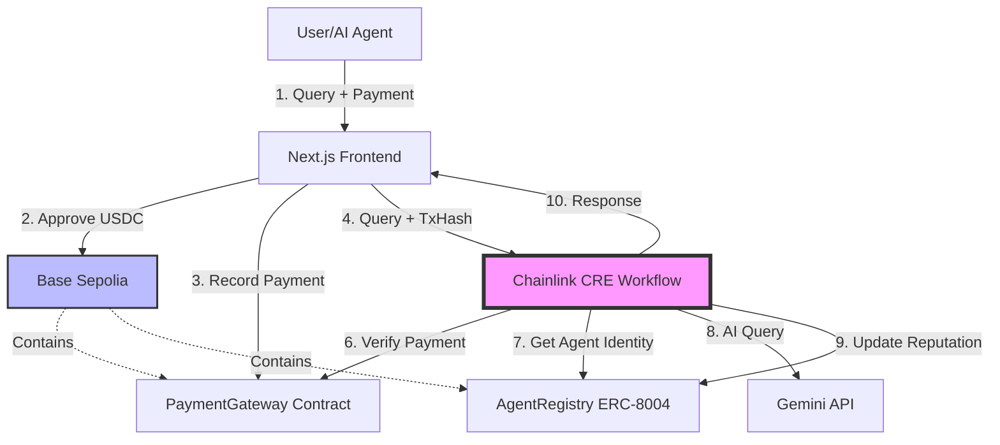

# MindChain CRE �⚡

**Decentralized AI Knowledge Platform powered by Chainlink Runtime Environment**

[](https://chain.link)
[](https://x402.org)
[](https://eips.ethereum.org/EIPS/eip-8004)
[](https://sepolia.basescan.org)

> Built for the [Chainlink Convergence Hackathon 2026](https://chain.link/hackathon) - CRE & AI Track

---

## 🎯 Overview

**MindChain CRE** is a decentralized AI knowledge platform that demonstrates how **Chainlink Runtime Environment (CRE)** can orchestrate complex AI workflows combining:
- � **MNIST Digit Recognition** - Draw digits and get AI predictions
- 📚 **Community Knowledge Sharing** - Submit and vote on knowledge
- 💬 **AI Chat Assistant** - Powered by Gemini API
- 🆔 **Agent Identity System** - ERC-8004 on-chain reputation
- 💰 **x402 Micropayments** - Pay-per-use with USDC

### The Problem
- AI agents lack verifiable identities and reputation systems
- AI service consumption requires micropayment infrastructure
- Complex AI workflows need reliable orchestration across chains and APIs
- Current AI systems lack transparency and auditability

### The Solution
Use **Chainlink CRE** as the orchestration layer to coordinate:
1. 🧠 **AI Knowledge Operations** - Query processing, knowledge retrieval, response generation
2. 💰 **On-Chain Micropayments** - Pay-per-use AI services with USDC on Base Sepolia
3. 🆔 **Agent Identity Management** - ERC-8004 registry for agent reputation
4. 🔗 **Cross-chain Coordination** - Seamless interaction between Blockchain and external APIs

### 💡 Why Chainlink CRE?
CRE acts as the **Decentralized Backend** that bridges the gap between on-chain payments and off-chain AI.
1.  **Trusted Conductor**: It verifies users have paid (on-chain) before triggering expensive AI computations (off-chain).
2.  **Secret Management**: Keeps API keys (Gemini/OpenAI) secure within the runtime, never exposing them to the frontend.
3.  **Verifiable Logic**: The workflow logic (`main.ts`) is immutable and verifiable, unlike a standard private backend.

---

## 🏗️ Architecture



---

## ✨ Key Features

- ✅ **Chainlink CRE Orchestration** - TypeScript workflows with HTTP triggers and AI integration
- ✅ **Direct On-Chain Micropayments** - Pay-per-use AI services with USDC
- ✅ **ERC-8004 Agent Registry** - On-chain agent identities and reputation
- ✅ **AI Integration** - Gemini/OpenAI for knowledge responses
- ✅ **Context-Aware Chat** - Remembers conversation history for natural interaction
- ✅ **Base Sepolia (L2)** - Fast, cheap transactions with ETH compatibility
- ✅ **Verifiable Execution** - All AI operations recorded on-chain

---

## 🛠️ Tech Stack

| Layer | Technology | Purpose |
|-------|------------|---------|
| **Orchestration** | Chainlink CRE (TypeScript SDK) | Workflow coordination |
| **Blockchain** | Base Sepolia (L2) | Smart contracts & payments |
| **Payments** | USDC + PaymentGateway Contract | Micropayment infrastructure |
| **AI** | Gemini/OpenAI APIs | Knowledge generation |
| **Frontend** | Next.js 14 + Tailwind + viem | User interface |
| **Contracts** | Solidity + Hardhat | ERC-8004 registry |

---

## 🚀 Quick Start

### Prerequisites

- Node.js 18+
- CRE CLI installed ([Installation Guide](https://docs.chain.link/chainlink-runtime-environment))
- CRE account at [cre.chain.link](https://cre.chain.link)
- MetaMask with **Base Sepolia** testnet configured
- Base Sepolia ETH from [faucet](https://www.alchemy.com/faucets/base-sepolia)

### Installation

```bash
# Clone the repository
git clone https://github.com/HACK3R-CRYPTO/MindChain-CRE-.git
cd agentmind-cre

# Install CRE CLI (if not already installed)
curl -sSL https://install.chain.link/cre | bash

# Authenticate with CRE
cre login

# Install frontend dependencies
cd ../../frontend
npm install
```

### Environment Setup

Create `.env` files in the appropriate directories:

**`workflows/ai-agent/.env`**
```bash
CRE_API_KEY=your_cre_api_key
GEMINI_API_KEY=your_gemini_key
OPENAI_API_KEY=your_openai_key
SEPOLIA_RPC=https://sepolia.infura.io/v3/YOUR_KEY
```

**`contracts/.env`**
```bash
PRIVATE_KEY=your_private_key
BASE_SEPOLIA_RPC=https://sepolia.base.org
ETHERSCAN_API_KEY=your_etherscan_key
```


### Deploy Smart Contracts

```bash
cd contracts
npx hardhat compile
npx hardhat run scripts/deploy.ts --network baseSepolia
```

### Simulate CRE Workflow


### Run the Application

```bash
# Start frontend
cd frontend
npm run dev

# Open http://localhost:3000
```

---

## 📁 Project Structure

```
mindchain-cre/
├── ai-agent/               # CRE workflow (TypeScript)
│   ├── main.ts             # Main workflow logic
│   └── package.json
├── project.yaml            # CRE Project Config
└── secrets.yaml            # Encrypted secrets (gitignored)
contracts/                  # Smart contracts (Solidity)
├── contracts/
│   ├── AgentRegistry.sol   # ERC-8004 agent registry
│   ├── PaymentGateway.sol  # On-chain payment verification
│   └── KnowledgeShare.sol  # Community knowledge contract
└── scripts/deploy.ts
frontend/                   # Next.js frontend
├── app/
│   ├── api/                # API routes (Chat, etc.)
│   ├── page.tsx            # Main page
│   └── layout.tsx
├── components/
│   ├── mnist-canvas.tsx
│   ├── knowledge-share.tsx
│   ├── ai-chat.tsx
│   └── providers.tsx
└── lib/wagmi.ts
mnist_api/                  # MNIST prediction API (Python)
├── app.py
├── model.keras
└── requirements.txt
_archive/                   # Legacy code (gpt_api, backend)
```

## 📚 Component Documentation

Detailed documentation for each component can be found here:

| Component | Description | Config & Setup |
|-----------|-------------|----------------|
| [**🖥️ Frontend**](./frontend/README.md) | Next.js UI, Wallet, & Canvas | `frontend/.env.local` |
| [**📜 Smart Contracts**](./contracts/README.md) | Solidity code & Deploy scripts | `contracts/.env` |
| [**🔮 CRE Agent**](./mindchain-cre/ai-agent/README.md) | Chainlink Workflow & AI Logic | `mindchain-cre/secrets.yaml` |
| [**👁️ Vision Node**](./mnist_api/README.md) | Python API for MNIST Model | `mnist_api/requirements.txt` |

---

## 🔗 Chainlink Integration

This project uses the following Chainlink components:

### CRE Workflow (`mindchain-cre/ai-agent/`)
- [**main.ts**](./mindchain-cre/ai-agent/main.ts): Main workflow logic using Chainlink CRE SDK.
  - **HTTP Trigger**: Receives user queries via HTTP endpoint.
  - **HTTP Client Capability**: Calls Gemini/OpenAI APIs.
  - **Simulation Mode**: Uses `frontend/lib/simulation.ts` for instant demo.

### Smart Contracts (`contracts/`)
- [**AgentRegistry.sol**](./contracts/contracts/AgentRegistry.sol): ERC-8004 compliant agent identity registry (MindChain Identity NFT).
- [**PaymentGateway.sol**](./contracts/contracts/PaymentGateway.sol): x402 payment verification contract.
- [**KnowledgeShare.sol**](./contracts/contracts/KnowledgeShare.sol): Community knowledge submission and voting system.

---

## 🎥 Demo Video

[Watch the 3-minute demo](https://youtu.be/YOUR_VIDEO_ID)

---

## 🧪 Testing

### Simulate CRE Workflow
```bash
cd mindchain-cre/ai-agent
cre workflow simulate .
```

### Test Smart Contracts
```bash
cd contracts
npx hardhat test
```

### End-to-End Test
1. Connect wallet to **Base Sepolia**
2. Register as an AI agent
3. Submit a query: "What is blockchain?"
4. Approve USDC payment
5. Receive AI response
6. Verify transaction on **BaseScan**

---

## 📊 Deployed Contracts

| Contract | Address | Explorer |
|----------|---------|----------|
| AgentRegistry | `0x0Cd8459F4cAc09517392896639938dDA01dD6fd9` | [View on Basescan](https://sepolia.basescan.org/address/0x0Cd8459F4cAc09517392896639938dDA01dD6fd9) |
| PaymentGateway | `0xa6f0e4027F97B448369463288c46436D3DaD6b24` | [View on Basescan](https://sepolia.basescan.org/address/0xa6f0e4027F97B448369463288c46436D3DaD6b24) |
| USDC (Base Sepolia) | `0x036CbD53842c5426634e7929541eC2318f3dCF7e` | [View on Basescan](https://sepolia.basescan.org/address/0x036CbD53842c5426634e7929541eC2318f3dCF7e) |

---

## 🏆 Hackathon Requirements

✅ **CRE Workflow**: TypeScript workflow with HTTP trigger and AI integration  
✅ **Blockchain + External Integration**: Base Sepolia + Gemini API + PaymentGateway
✅ **Hybrid Deployment**: CRE CLI simulation (primary) + production-ready contracts
✅ **Enhanced AI**: Context-aware Chat, Knowledge Verification, and Image Recognition
✅ **Demo Video**: 3-5 minute walkthrough  
✅ **Public Source Code**: GitHub repository  
✅ **README with Chainlink Links**: Comprehensive documentation  

---

## 🤝 Contributing

This project was built for the Chainlink Convergence Hackathon 2026. Contributions, issues, and feature requests are welcome!

---

## 📄 License

MIT License - see [LICENSE](./LICENSE) for details.

---

## 🙏 Acknowledgments

- [Chainlink](https://chain.link) for the CRE platform
- [x402 Protocol](https://x402.org) for payment infrastructure
- [ERC-8004](https://eips.ethereum.org/EIPS/eip-8004) for agent identity standard

---

**Built with ❤️ for the Chainlink Convergence Hackathon 2026**
