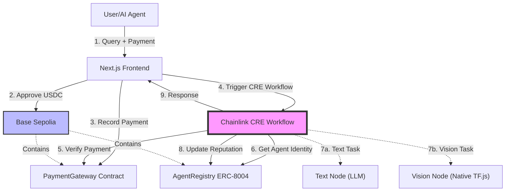

# MindChain CRE �⚡

**Decentralized AI Knowledge Platform powered by Chainlink Runtime Environment**

[](https://chain.link)
[](https://x402.org)
[](https://eips.ethereum.org/EIPS/eip-8004)
[](https://sepolia.basescan.org)

> Built for the [Chainlink Convergence Hackathon 2026](https://chain.link/hackathon) - CRE & AI Track

---

## 🎯 Overview

**MindChain CRE** is a composable playground where agents build **ERC-8004 Identity**, purchase usage credits (**x402**), and **power Heterogeneous AI Compute (Vision & Text)** with **verifiable, community-owned knowledge**—orchestrated by **Chainlink CRE**.

It demonstrates how **Chainlink Runtime Environment (CRE)** can orchestrate complex AI workflows including:
- **Vision Node (MNIST)** - Specialized native compute for image recognition (TensorFlow.js)
- 📚 **Community Knowledge** - Verifiable, community-owned data
- 💬 **Text Node (Chat)** - General purpose LLM (Gemini) with **Seamless Intelligence Flow**
- 🆔 **Context-Aware Chat** - Personalized AI memory per user (session history)
- � **Premium UI** - Full **Markdown Support** (Bolding, lists, code blocks) for AI responses
- �💰 **x402 Micropayments** - Pay-per-use with USDC (Seamless onboarding)

### 🧠 Universal Compute Orchestration

MindChain demonstrates that Chainlink CRE can orchestrate **any** type of off-chain compute, not just LLMs.
*   **Vision Node (MNIST Demo)**: Proves the network can handle **Specialized Compute** (Native TensorFlow.js) for specific tasks like **digit recognition (0-9)**.
*   **Text Node (Chat Demo)**: Proves the network can handle **General Purpose Compute** (LLMs) for knowledge retrieval.

This proves that MindChain is a **Universal Compute Orchestrator**.

### The Problem
- AI agents lack verifiable identities and reputation systems
- AI service consumption requires micropayment infrastructure
- Complex AI workflows need reliable orchestration across chains and APIs
- Current AI systems lack transparency and auditability

### The Solution
Use **Chainlink CRE** as the orchestration layer to coordinate:
1. 🧠 **AI Knowledge Operations** - Query processing, knowledge retrieval, response generation
2. 💰 **On-Chain Micropayments** - Pay-per-use AI services with USDC on Base Sepolia
3. 🆔 **Agent Identity Management** - ERC-8004 registry for agent reputation
4. 🔗 **Cross-chain Coordination** - Seamless interaction between Blockchain and external APIs

### 💡 Why Chainlink CRE?
CRE acts as the **Decentralized Backend** that bridges the gap between on-chain payments and off-chain AI.
1.  **Trusted Conductor**: It verifies users have paid (on-chain) before triggering expensive AI computations (off-chain).
2.  **Secret Management**: Keeps API keys (Gemini/OpenAI) secure within the runtime, never exposing them to the frontend.
3.  **Verifiable Logic**: The workflow logic (`main.ts`) is immutable and verifiable, unlike a standard private backend.

---

## 🏗️ Architecture


```mermaid
graph TB
    User[User/AI Agent] -->|1. Query + Payment| Frontend[Next.js Frontend]
    Frontend -->|2. Approve USDC| BaseSepolia[Base Sepolia]
    Frontend -->|3. Record Payment| PaymentGateway["PaymentGateway Contract"]
    Frontend -->|4. Trigger CRE Workflow| CRE[Chainlink CRE Workflow]
    
    CRE -->|5. Verify Payment| PaymentGateway
    CRE -->|6. Get Agent Identity| AgentRegistry["AgentRegistry ERC-8004"]
    
    CRE -.->|7a. Text Task| Gemini["Text Node (LLM)"]
    CRE -.->|7b. Vision Task| VisionNode["Vision Node (Native TF.js)"]
    
    CRE -->|8. Update Reputation| AgentRegistry
    CRE -->|9. Response| Frontend
    
    BaseSepolia -.->|Contains| PaymentGateway
    BaseSepolia -.->|Contains| AgentRegistry
    
    style CRE fill:#f9f,stroke:#333,stroke-width:4px
    style BaseSepolia fill:#bbf,stroke:#333,stroke-width:2px
```

---

## ✨ Key Features

- ✅ **Universal Compute Orchestration** - Chainlink CRE orchestrating both Vision (Native) and Text (LLM) Nodes.
- ✅ **Seamless Intelligence Flow** - Natural distinction between on-chain verified data and general AI knowledge without robotic labels.
- ✅ **Markdown Supported Chat** - Professional rendering of AI responses (bold, lists, etc.) using `@tailwindcss/typography`.
- ✅ **Heterogeneous AI** - Vision Nodes (MNIST/TF.js) and Text Nodes (Gemini) working in parallel.
- ✅ **Resilient Architecture** - Full Simulation Fallback for reliable, glitch-free demos.
- ✅ **Direct On-Chain Micropayments** - Pay-per-use AI services with USDC.
- ✅ **ERC-8004 Agent Registry** - On-chain agent identities and reputation.
- ✅ **Context-Aware Chat** - Remembers conversation history for natural interaction with knowledge.
- ✅ **Base Sepolia (L2)** - Fast, cheap transactions with ETH compatibility.
- ✅ **Verifiable Execution** - All AI operations recorded on-chain.

---

## 🛠️ Tech Stack

| Layer | Technology | Purpose |
|-------|------------|---------|
| **Orchestration** | Chainlink CRE (TypeScript SDK) | Workflow coordination |
| **Blockchain** | Base Sepolia (L2) | Smart contracts & payments |
| **Payments** | USDC + PaymentGateway Contract | Micropayment infrastructure |
| **AI** | Gemini/OpenAI APIs | Knowledge generation |
| **Frontend** | Next.js 14 + Tailwind + viem | User interface |
| **Contracts** | Solidity + Hardhat | ERC-8004 registry |

---

## 🚀 Quick Start

### Prerequisites

- Node.js 18+
- CRE CLI installed ([Installation Guide](https://docs.chain.link/chainlink-runtime-environment))
- CRE account at [cre.chain.link](https://cre.chain.link)
- MetaMask with **Base Sepolia** testnet configured
- Base Sepolia ETH from [faucet](https://www.alchemy.com/faucets/base-sepolia)

### Installation

```bash
# Clone the repository
git clone https://github.com/HACK3R-CRYPTO/MindChain-CRE-.git
cd agentmind-cre

# Install CRE CLI (if not already installed)
curl -sSL https://install.chain.link/cre | bash

# Authenticate with CRE
cre login

# Install frontend dependencies
cd frontend
npm install
```

### Environment Setup

Create `.env` files in the appropriate directories:

**`workflows/ai-agent/.env`**
```bash
CRE_API_KEY=your_cre_api_key
GEMINI_API_KEY=your_gemini_key
OPENAI_API_KEY=your_openai_key
SEPOLIA_RPC=https://sepolia.infura.io/v3/YOUR_KEY
```

**`contracts/.env`**
```bash
PRIVATE_KEY=your_private_key
BASE_SEPOLIA_RPC=https://sepolia.base.org
ETHERSCAN_API_KEY=your_etherscan_key
```


### Deploy Smart Contracts

```bash
cd contracts
npx hardhat compile
# Deploy individual components
npx hardhat run scripts/deploy-agent-registry.ts --network sepolia
npx hardhat run scripts/deploy.ts --network sepolia # PaymentGateway
```

### Simulate CRE Workflow

We use a standardized simulation command to verify on-chain identity and AI logic:

```bash
# From the root directory
npm run dev:workflow
```

This command runs `cre workflow simulate` for the `ai-agent/` workflow, using `payload.json` and your encrypted secrets.

```bash
# Start frontend
cd frontend
npm run dev

# Open http://localhost:3000
```

---

## 📁 Project Structure

```
mindchain-cre/
├── ai-agent/               # CRE workflow (TypeScript)
│   ├── main.ts             # Core AI Workflow + On-Chain Identity
│   ├── workflow.yaml       # CRE Workflow Config
│   └── package.json
├── project.yaml            # CRE Project Config (Root)
├── secrets.yaml            # Secret mappings (Root)
└── payload.json            # Simulation payload
contracts/                  # Smart contracts (Solidity)
├── contracts/
│   ├── AgentRegistry.sol   # ERC-8004 Registry (w/ getAgentInfo)
│   ├── PaymentGateway.sol  # On-chain payment verification
│   └── KnowledgeShare.sol  # Community knowledge contract
└── scripts/deploy.ts
frontend/                   # Next.js frontend
├── app/
│   ├── api/                # API routes (Chat, etc.)
│   ├── page.tsx            # Main page
│   └── layout.tsx
├── components/
│   ├── agent-registry.tsx  # Enhanced Identity UI
│   ├── mnist-canvas.tsx
│   ├── knowledge-share.tsx
│   ├── ai-chat.tsx
│   └── providers.tsx
└── lib/wagmi.ts
mnist_api/                  # MNIST prediction API (Python)
├── app.py
├── model.keras
└── requirements.txt
_archive/                   # Legacy code (gpt_api, backend)
```

## 📚 Component Documentation

Detailed documentation for each component can be found here:

| Component | Description | Config & Setup |
|-----------|-------------|----------------|
| [**🖥️ Frontend**](./frontend/README.md) | Next.js UI, Wallet, & Canvas | `frontend/.env.local` |
| [**📜 Smart Contracts**](./contracts/README.md) | Solidity code & Deploy scripts | `contracts/.env` |
| [**🔮 CRE Agent**](./mindchain-cre/ai-agent/README.md) | Chainlink Workflow & AI Logic | `mindchain-cre/secrets.yaml` |
| [**👁️ Vision Node**](./mnist_api/README.md) | Python API for MNIST Model | `mnist_api/requirements.txt` |

---

## 🔗 Chainlink Integration

This project uses the following Chainlink components:

### CRE Workflow (`ai-agent/`)
- [**main.ts**](./ai-agent/main.ts): Main workflow logic using Chainlink CRE SDK.
  - **On-Chain Identity**: Uses `ethers` to fetch real-time identity/reputation via `getAgentInfo`.
  - **Secret Management**: Uses `runtime.getSecret().result()` for standardized security.
  - **HTTP Client Capability**: Calls Gemini AI.

### Smart Contracts (`contracts/`)
- [**AgentRegistry.sol**](./contracts/contracts/AgentRegistry.sol): ERC-8004 Identity Registry with on-chain name storage.
- [**PaymentGateway.sol**](./contracts/contracts/PaymentGateway.sol): x402 payment verification.
- [**KnowledgeShare.sol**](./contracts/contracts/KnowledgeShare.sol): Community knowledge system.

---

## 🎥 Demo Video

[Watch the 3-minute demo](https://youtu.be/YOUR_VIDEO_ID)

---

## 🧪 Testing

### Simulate CRE Workflow
```bash
# Run the local simulation with root-level secrets
npm run dev:workflow
```

### Test Smart Contracts
```bash
cd contracts
npx hardhat test
```

### End-to-End Test
1. Connect wallet to **Base Sepolia**
2. Register as an AI agent
3. Submit a query: "What is blockchain?"
4. Approve USDC payment
5. Receive AI response
6. Verify transaction on **BaseScan**

---

## 📊 Deployed Contracts

| Contract | Address | Explorer |
|----------|---------|----------|
| AgentRegistry | `0xB16DFC88DEA04642aAB9F06C3605FD0d1D3Bfd63` | [View on Basescan](https://sepolia.basescan.org/address/0xB16DFC88DEA04642aAB9F06C3605FD0d1D3Bfd63) |
| PaymentGateway | `0xD7c2951C3eCE0aad1a4e8264107e34DCfbC4018B` | [View on Basescan](https://sepolia.basescan.org/address/0xD7c2951C3eCE0aad1a4e8264107e34DCfbC4018B) |
| USDC (Base Sepolia) | `0x036CbD53842c5426634e7929541eC2318f3dCF7e` | [View on Basescan](https://sepolia.basescan.org/address/0x036CbD53842c5426634e7929541eC2318f3dCF7e) |

---

## 🏆 Hackathon Requirements (CRE & AI Track)

MindChain was purpose-built to perfectly hit the **$17,000 CRE & AI Track** requirements for combining intelligence with verifiable execution:

✅ **"Integrate at least one blockchain with an external API, system, data source, LLM..."**  
*We integrate Base Sepolia (ERC-8004 Registry + Payments), the Gemini LLM (Text Compute), a Python Vision Node (Specialized Compute), and IPFS (Data Source) all orchestrated via a single CRE workflow.*

✅ **"AI agents consuming CRE workflows with x402 payments"**  
*Both our Vision Node (MNIST Drawing) and Text Node (AI Chat) natively implement the x402 protocol specification. The frontend forces an on-chain USDC/ETH payment on Base Sepolia before the Next.js API permits the compute request.*

✅ **"AI agent blockchain abstraction"**  
*The CRE workflow (`ai-agent/main.ts`) intercepts AI chat requests, verifies the agent's identity and reputation on the Base Sepolia blockchain, and injects that verified context into the LLM prompt. The AI treats the blockchain as its ultimate source of truth.*

✅ **"Demonstrate a successful simulation (via the CRE CLI)"**  
*Our core logic runs flawlessly in the CRE simulator. See the demo video for the live terminal execution proving our orchestration logic is atomic and verifable.*


---

## 🤝 Contributing

This project was built for the Chainlink Convergence Hackathon 2026. Contributions, issues, and feature requests are welcome!

---

## 📄 License

MIT License - see [LICENSE](./LICENSE) for details.

---

## 🙏 Acknowledgments

- [Chainlink](https://chain.link) for the CRE platform
- [x402 Protocol](https://x402.org) for payment infrastructure
- [ERC-8004](https://eips.ethereum.org/EIPS/eip-8004) for agent identity standard

---

**Built with ❤️ for the Chainlink Convergence Hackathon 2026**
